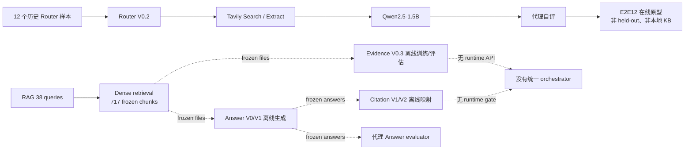
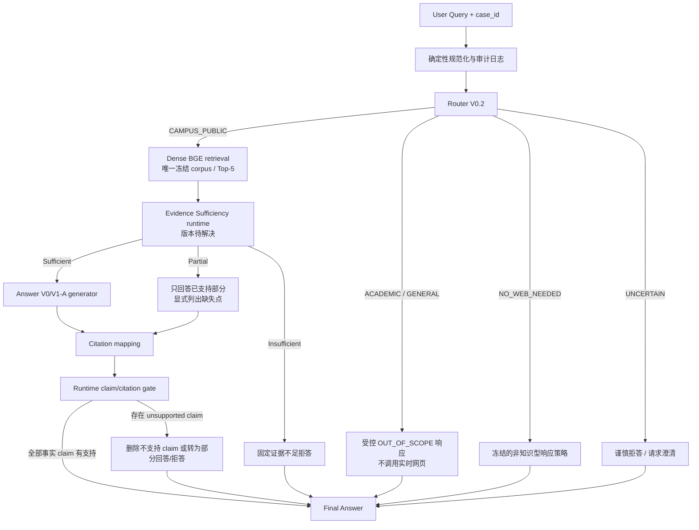

# E2E Evaluation V1 Readiness Report

> 审计日期：2026-08-15（Asia/Shanghai）  
> 审计快照：Git `4aee0de85b3fd57fd5ffdb66ec9f5ca9e9e655de`，分支 `main`，工作树非 clean  
> 本报告只做现状盘点与实验设计；未运行、重跑或启动任何 E2E/历史实验，未修改 frozen 数据、Prompt、模型、结果或目录结构。

## 1. Current System Inventory

本仓库不存在一条已经冻结、可直接复现的“本地知识库端到端生产 Pipeline”。当前实际状态是一个在线 E2E12 原型，加上若干相互分离的离线评估模块。

| 资产 | 实际位置 / 版本 | 状态与实证 | 审计结论 |
|---|---|---|---|
| Router | `experiments/router_v0_2/src/router_v0_2.py`，V0.2 | 输入为 `query: str`；输出 `mode/scores/triggered_signals/router_reason/confidence/decision_margin`；标签为 `ACADEMIC_RETRIEVAL`、`CAMPUS_PUBLIC`、`GENERAL_WEB`、`NO_WEB_NEEDED`、`UNCERTAIN`。Development-24、Frozen Full-30、Blind Shadow-42 均报告 100% | 有冻结测试，但实现主要是关键词、正则和手工本体；对同义改写、跨语言和分布外表达的泛化仍有风险 |
| Router/Academic 旧链路 | `experiments/web_search_v0_followup/`，Router V0.1 / Academic Retrieval V0.1 | Frozen Academic-10 为 10/10；Full-30 为 30/30；Academic Shadow-24 的 router accuracy 仅 16/24（66.67%），即使报告同时给出 retrieval sufficiency 100% | 旧链路结果不能被 V0.2 的 100% 覆盖或改写；在线搜索依赖也不适合作为闭集可复现主基线 |
| 现有在线原型 | `experiments/e2e12_router_v0_2/` | Router V0.2 → Tavily Web Search/Extract → Qwen2.5-1.5B。本地代理评估：12/12 路由正确；correctness 5/12 归一化等价（41.67%）；faithfulness 62.50%；unsupported claims 10/27（37.04%）；citation presence 7/12（58.33%）；无人工复核 | 是集成实验，不是本地 RAG V1 + Evidence + Citation 的正式实现；12 题全部来自 Blind-42，不独立 |
| Corpus / RAG V0 | `evaluation/rag/v0/` | `PROVISIONAL_KB_V0`：238 sources（234 public + 4 restricted）、717 chunks，`chunks.jsonl` SHA256 为 `de606…`；索引完整性报告为 PASS | 字节可冻结，但内容资格未完成：234 条 public staging manifest 中仍标记 `qa_status=pending_human_check` |
| Public Expansion 最新候选 | `data/02_public_expansion/v2/` | canonical pool 165 条、V3.2 approve 154 条；49 条 adjudicated 人工参考样本的一致率为 35/49（71.43%），含 false approve 3/49（6.12%） | 该 49 条是人工参考，不是绝对 gold；且不能证明代表全部 165 条。它与 RAG 所用 234 条 staging corpus 不是同一冻结口径 |
| Retriever | `evaluation/rag/v1/scripts/retrieval_engine.py`，RAG V1 | TF-IDF、Dense、Hybrid RRF、Hybrid+reranker 均有离线结果。报告推荐 Dense：`BAAI/bge-small-zh-v1.5` revision `7999e1…`；中文 query instruction；R@1 72.7%、R@3 87.9%、R@5 90.9%、R@10 93.9%、MRR 0.808；推荐运行口径为 Top-5 | Dense 是当前唯一合理候选；38 题中 28 条仍为 PROVISIONAL，5 条 expected source 不确定；未启用 bilingual query expansion |
| Evidence Sufficiency V0.1 | `experiments/evidence_sufficiency_v0_1/` | 确定性 required-point lexical overlap；5 条 holdout 报告 100% | 样本过小，不可作为正式 runtime gate |
| Evidence Sufficiency V0.2 | `experiments/evidence_sufficiency_v0_2/`，候选 v0.2-d | 确定性 span coverage；real holdout 7/8，synthetic 15/24；partial 仅 1/3 | 历史内部实验，不是最终 runtime 版本 |
| Evidence Sufficiency V0.3 | `experiments/evidence_sufficiency_v0_3/`，frozen candidate `v0.3-c` | Random Forest；输入依赖 lexical/structural/requested-attribute proxy features，并非真实 semantic entailment。147 条 Query+Evidence 记录只含 49 个唯一 query；real nested-CV 34/49（69.4%），false-sufficient 4/15（26.7%），Partial recall 37.5%；结论为 `NOT_READY_FOR_NEW_BLIND` | 是“最新完成的冻结实验候选”，不是“可用于正式 E2E 的 runtime gate” |
| Evidence Sufficiency V0.4 | `experiments/evidence_sufficiency_v0_4/`，候选 v0.4-a | 计划输出 core points、requested attributes、optional support 和 ENTAILED/PARTIAL/NOT_FOUND/CONTRADICTED matrix；首条真实样本即因本地 Ollama/4096 context/HTTP 502 阻断；无 semantic matrix、CV 或回归结果 | 目录存在但实验未完成，状态 `SEMANTIC_ENGINE_UNAVAILABLE`；不得当作可用版本 |
| Answer Generation V0 | `evaluation/answer_generation/v0/` | 38/38 生成、38/38 自动评估完成；Dense Top-5；`Qwen/Qwen2.5-1.5B-Instruct-GGUF` revision `91cad…`，Q4_K_M，llama-cpp-python 0.3.34，CPU，ctx 6144，max new 128，temperature 0，seed 20260813；Prompt 限制 evidence-only、`[C1]`–`[C5]` 和固定拒答 | 可作为冻结生成配置候选，但不是可复用 runtime 模块；自动指标相互冲突且没有人工确认 |
| Answer Generation V1 A/B | `evaluation/answer_generation/v1/` | A 与 V0 的 38 条答案 byte-identical；B 严格 Prompt 更差，报告建议保留 A。A 的新评估器却给出 correctness/faithfulness 98.68%，与 V0 评估口径大幅冲突 | 只能选 A 作为生成配置；不能沿用其代理分数作为正式效果证据 |
| Citation Mapping V1/V2 | `evaluation/citation/v1/`、`evaluation/citation/v2/` | 均为对 38 条 frozen A answers 的离线后处理。V1 claim coverage 12/104（11.54%）；V2A/B/C 约 49.04%/52.88%/51.92%，answer compliance 仍为 8/38（21.05%）。V2 reranker 对 20/20 hard negatives 都给出高于 0.95 的分数，不能当 entailment verifier | 尚无已校准的通用 runtime citation mapper；human calibration 表为空 |
| Unsupported/Faithfulness/Refusal | Answer/Citation evaluation 脚本 | 目前仅是 offline evaluation rules / proxy evaluators | 不是在线运行时 Gate |
| Safety Gate | 数据准入侧有 restricted-data `safety_gate`；问答侧未发现统一模块 | 数据入库安全与答案事实安全不是同一接口 | 答案 runtime Safety/Faithfulness Gate 不存在 |
| Prompt | `evaluation/answer_generation/v0/config/grounded_generation_prompt.md`；另有 `prompts/prompt_v3_2.md` | 前者是回答 Prompt；后者是 Public Expansion 内容审核 Prompt | 两者用途不同，V3.2 不能被当作 Answer Generator Prompt |
| Human / Gold | Public Expansion human check；RAG/Evidence 的 adjudicated/provisional 标签 | 多处报告明确使用 human reference、provisional proxy 或 adjudication；没有证据支持统一的绝对 gold truth | 后续必须分别记录 `human_reference`、`adjudicated_reference`、`proxy`，禁止统称 gold |

主要一致性冲突：

- Answer V0 报告给出 unsupported 1/109（0.92%）、correct refusal 2、hallucination 1；`answer_evaluation_summary.json` 却为 unsupported 5/114（4.39%）、correct refusal 3、hallucination 3。
- 同一组 A answers 在 V0 与 V1 evaluator 下从约 61.84%/64.47% 变为 98.68%/98.68%，说明 evaluator 定义变化足以主导结论。
- RAG V1 报告声称交通来源存在缺口；Answer V0 的同一 717-chunk 冻结语料却检索到 `STGPUB-0077` 的具体交通信息。报告、样例与语料解释不一致。
- 项目映射声明旧 `data_second` 已迁移，但 Answer/Citation 多个脚本及 freeze 记录仍硬编码旧绝对路径或错误 sibling 路径。

## 2. Recommended Frozen Components

以下是当前唯一不猜测的选择。`UNRESOLVED` 表示正式 E2E 前必须先作出并冻结决定；不表示本轮要修复或执行。

| 组件 | E2E V1 唯一建议 | 冻结/可用性判断 |
|---|---|---|
| Router | Router V0.2：`experiments/router_v0_2/` | **候选可冻结**；保留其规则版本、配置、Blind-42 freeze 和输入输出 schema；不得把 100% 解释为分布外可靠性 |
| Retriever | RAG V1 Dense：BGE-small-zh-v1.5 revision `7999e1…`，中文 query instruction，Top-5 | **候选可冻结**；不启用 bilingual expansion；不选 Hybrid/Reranker |
| Corpus | `UNRESOLVED` | 现有 238-source/717-chunk `PROVISIONAL_KB_V0` 字节虽冻结，但 234 条 public 的人工准入状态、与 Public Expansion V2 165/154 口径差异均未闭合 |
| Evidence Sufficiency | `UNRESOLVED` | V0.3-c 是最新完成候选但明确 `NOT_READY_FOR_NEW_BLIND`，且无 runtime adapter；V0.4 未完成 |
| Generator | Answer V0 / V1 Group A 的 frozen generation config 与 Prompt 主体 | **有条件候选**；模型、revision、GGUF quant、llama-cpp 版本及 decoding 参数必须原样锁定；不能继承旧代理分数 |
| Citation | `UNRESOLVED` | Citation V2-B 可作为离线诊断的当前较优规则，但没有证据支持把它提升为 runtime gate；V2-C reranker 不能作为 entailment verifier |
| Runtime Gate | `UNRESOLVED` | 未发现统一执行 Evidence decision、unsupported-claim veto、correct refusal 和 safety policy 的 runtime 模块 |

因此，当前不存在一组七项全部 resolved 的正式 frozen component bundle。

## 3. Current Pipeline

当前有两条不同性质的链路，不能合称为一个已完成系统：



在线原型没有复用 RAG V1 本地语料、Evidence V0.3 或 Citation V2；本地模块之间则主要通过历史结果文件连接，不是请求级 runtime 调用。

## 4. Proposed E2E V1 Pipeline

为保证 corpus 与 Baseline 公平且避免引入不可冻结的在线搜索，V1 建议明确限定为“闭集校园知识库问答 + Router 边界控制”。`ACADEMIC_RETRIEVAL` 和 `GENERAL_WEB` 在没有独立 frozen downstream 前只评估路由及受控 `OUT_OF_SCOPE` 行为，不调用实时网页。若产品目标要求对这两路也回答，则必须先冻结各自 corpus/retriever，当前设计维持 NO-GO。



接口契约应在实验前一次性冻结：

| 步骤 | 输入 | 输出 | 当前文件/模块 | frozen | 适配问题 |
|---|---|---|---|---|---|
| Router | `query`, `case_id` | route label、confidence、reason | Router V0.2 | 候选是 | label 到 downstream action 的映射未冻结 |
| Retrieval | query、corpus/index ID、Top-5 | 有序 chunks：source/chunk/title/url/text/score | RAG V1 Dense | 候选是 | corpus 身份未解决；脚本偏评估式而非统一 service API |
| Evidence | query + ordered chunks | `Sufficient/Partial/Insufficient`、core points、requested attributes、optional support、point-to-evidence matrix | 无合格 runtime；V0.4 仅有未完成 schema | 否 | **BLOCKER**：版本、模型和 adapter 均未解决 |
| Decision | route + evidence result | `ANSWER/PARTIAL/REFUSE/OUT_OF_SCOPE` | 不存在统一模块 | 否 | **BLOCKER**：策略只散落在 Prompt/评估脚本 |
| Generation | query + approved evidence subset + decision | answer with claim/citation markers | Answer V0/V1-A 配置 | 有条件 | 历史入口路径失效；需薄 adapter，但本轮不修 |
| Citation | answer claims + retrieved chunks | claim→evidence spans + support status | Citation V1/V2 离线脚本 | 否 | 绑定 38 条历史输出；无通用 runtime API/人工阈值 |
| Runtime Gate | claims、mapping、decision | final answer / veto reason | 不存在 | 否 | **BLOCKER** |

## 5. Baseline vs Ours

主实验只设置两个 arm；二元处理变量为“是否启用完整控制栈（Router + Evidence decision + refusal/partial policy + runtime citation gate）”。这是一项系统级复合干预，不把结果误解成某个单模块的因果增益。

| 项目 | Baseline：Standard RAG | Ours：Controlled E2E |
|---|---|---|
| Query / case order | 相同、预冻结 | 相同、预冻结 |
| Corpus / index | 同一 frozen corpus/index | 同一 frozen corpus/index |
| Retriever / Top-K | 同一 Dense BGE / Top-5 | 同一 Dense BGE / Top-5（只有 CAMPUS_PUBLIC 执行） |
| Generator | 同一 Qwen GGUF/revision/runtime | 同一 |
| Prompt 主体 | 同一 evidence-only 回答主体 | 同一主体，额外只传递已冻结的 decision 与允许证据集 |
| Decoding | 同一 temperature 0、seed、ctx、max tokens、threads | 同一 |
| 控制栈 | 不使用；所有 query 直接 Retrieval → Generation | 使用 Router → Evidence → Answer/Partial/Refuse → Citation Gate |

不可避免差异：Ours 对非校园 route、Insufficient 和部分 Partial case 会跳过生成或限制证据，因此检索/生成调用数、token 和 latency 不同；这正是控制栈的预期系统行为，必须单独报告，不能用额外更强模型或更多证据补偿。若后续要归因到单组件，应另行预注册 ablation，不并入 V1 主结论。

## 6. Benchmark Design

建议规模固定为 **50 条 query × 2 arms = 100 条系统输出**。八个 primary stratum 互斥，另允许 temporal、multi-point、route 等 secondary tags：

| Primary stratum | 数量 | 参考行为 |
|---|---:|---|
| A. Normal Answerable | 12 | Sufficient；完整且有支持地回答 |
| B. Partial Evidence | 7 | Partial；只回答支持部分并指出缺失 |
| C. Insufficient / Correct Refusal | 7 | Insufficient；正确拒答 |
| D. Hard Negative Retrieval | 6 | 不被高词面相似证据误导；通常 Partial/Insufficient |
| E. Router Boundary | 6 | 覆盖 Academic/Campus/General 近边界表达；route 与 action 均正确 |
| F. Temporal / Expired | 4 | 识别历史时点，不把旧材料陈述为当前事实 |
| G. Requested Attribute Missing | 4 | 对 deadline/address/price/eligibility/procedure 等缺失属性不补写 |
| H. Multi-point Query | 4 | 对每个 minimal core point 分别判断支持度 |
| **总计** | **50** |  |

构建原则：

1. 先解决并冻结 corpus，再从未用于任何历史 query/evidence 标注、Prompt 校准或错误分析的主题与表达构造候选；不得直接复用现有题目改几个词。
2. 每题在运行前冻结 `reference_route`、`reference_evidence_label`、minimal core required points、requested attributes、supported/missing points、reference action、允许的 source/chunk IDs、temporal validity。
3. 两名标注员独立标注 reference package；冲突由第三人 adjudicate。它叫 `adjudicated_reference`，不声称绝对 gold truth。
4. 若剩余 corpus 无法提供 50 条独立 Query+Evidence 单元，应缩小正式主张或补建下一版 corpus；不能拿历史 38/42/147 题回填。

## 7. Metrics

### Primary Metrics

| 指标 | 预注册定义 |
|---|---|
| Answer Correctness | 人工 0/1/2；报告各档计数/比例、均值/2 归一化；`2` 表示无实质错误且直接回答参考任务 |
| Faithfulness | 人工 0/1/2；只相对于该 arm 实际获得的证据；`2` 表示全部事实 claim 均可由证据支持 |
| Unsupported Claim Rate | `unsupported factual claims / all factual claims`；同时报告分子、分母、百分比；无事实 claim 的纯拒答不进入该分母 |
| Correct Refusal Rate | `reference action=REFUSE 且系统正确拒答 / 所有 reference REFUSE cases` |
| False Refusal Rate | `应 ANSWER 或 PARTIAL 却无正当理由完全拒答 / 所有 reference ANSWER+PARTIAL cases` |
| E2E Success Rate | 下述逐题布尔成功数 / 50；同时按八类报告分子、分母、百分比 |

逐题 `E2E_SUCCESS=1` 的冻结规则：

- route 与 `reference_route` 一致；
- 对 CAMPUS_PUBLIC，Evidence label 与 reference 完全一致；Answerable case 的 Top-5 覆盖全部 minimal core required points；Partial case 覆盖参考 supported subset 且不虚构 missing points；
- 系统 action 与 reference action 一致；
- Answer/Partial 输出的 correctness=2、faithfulness=2，unsupported factual claims=0；
- Answer 的 completeness=2；Partial 的 supported-part completeness=2、missing-points disclosure=2；Refusal 的 refusal correctness=2；
- 每个事实 claim 至少有一个人工判为 `fully supports` 的 citation span；纯拒答和冻结的非知识型响应不要求 citation。

任一条件失败即为 0，实验结束后不得调整门槛。

### Secondary Metrics

- Router accuracy：正确 route / 50，并报告 5×5 confusion matrix。
- Retrieval success：按 Answerable/Partial 分别报告 required-point coverage@5；不要只用 expected source 命中代替内容支持。
- Evidence：3-class confusion、每类 precision/recall/F1、Macro-F1、false-sufficient rate。
- Citation：claim coverage、claim-level support precision、answer-level compliance，均报告原始计数和比例。
- Partial handling：正确部分回答、错误完整回答、错误完全拒答的计数/比例。
- Latency：端到端及各 stage 的 median、P95；同时报告调用次数和 token 数。

Primary 指标决定结论；Secondary 只定位失败，不得稀释 Primary 结论。

## 8. Human Evaluation Protocol

人工评估覆盖全部 100 条输出，采用 arm-blind、顺序随机化、双人独立审核，即 **200 份独立评分记录**。审核者可见 query、该 arm 的实际 retrieved evidence、最终 answer 与 citation，但不可见 Baseline/Ours 名称、自动分数和另一位审核结果。

每题字段至少包括：`case_id`、匿名 `condition_id`、query、reference package version、retrieved chunk IDs、system action、answer、claim segmentation、citation spans、correctness(0/1/2)、faithfulness(0/1/2)、completeness(0/1/2)、partial_handling(0/1/2/NA)、refusal_correctness(0/1/2/NA)、逐 claim support(0/1/2)、unsupported_claim_count、critical_error_flags、reviewer_id、human_note、adjudication_status。

统一量表：

- 0：错误/缺失严重，或行为方向错误；1：部分正确但有重要缺口；2：满足该维度全部要求。
- Faithfulness 只判断 evidence 是否支持，不用外部常识替系统补证据。
- Completeness 对 Answer 看全部 core points；对 Partial 只看已支持部分覆盖，并另评 missing-points disclosure。
- Refusal correctness 只对参考应拒答或系统实际拒答的样本评估。

以下任一情况必须 adjudication：两人任一主维度不同、action correctness 不同、unsupported claim 数不同、citation support 不同、critical error flag 不同或 E2E success 推导不同。第三位 adjudicator 记录最终值与理由；原始两份意见保留。自动 evaluator 只输出 diagnostic，不是 ground truth。

## 9. Leakage Risks

已完成的只读精确/规范化查询核验显示：

| 历史集合 | 行数 / 唯一 query | 已确认重叠 |
|---|---:|---|
| Router Blind Shadow | 42 / 42 | 与 E2E12 为 12/12；与 Evidence V0.3 为 11 条 |
| E2E12 | 12 / 12 | 12 条全部来自 Router Blind-42；其中 11 条也在 Evidence V0.3 |
| RAG V1 / Answer V0/V1 / Citation V1/V2 | 38 / 38 | 38/38 全部出现在 Evidence V0.3 |
| Evidence V0.3 unified calibration | 147 rows / 49 unique queries | 同一 query 经多个 evidence/变体重复；另有 23 个 exact-pair duplicate groups，报告已标注大量 query overlap |

因此 Router42、E2E12、RAG38、Answer38、Citation38、Evidence147 均不得作为新 E2E 的 held-out 测试题。历史 Full-30、Frozen Academic-10、Academic Shadow-24、Prompt calibration、synthetic variants、gold/human_check 和错误分析样本也必须进入 exclusion registry。

正式防泄漏流程：

1. 建立只读 `exclusion_registry`：记录历史 `query_id/check_id/original_id/source_id`、原始 query SHA256、normalized query SHA256、Query+Evidence canonical SHA256、construction template family。
2. Exact：原始 query hash 零重合；Normalized：NFKC、大小写、全半角、空白、标点、数字/日期规范化后零重合。
3. Semantic/template：embedding 近邻筛查后由两人审查；同一 slot template、同义改写、只换机构/日期/属性名均判为泄漏。
4. Query+Evidence：canonical 化 ordered evidence source/chunk IDs 和文本 hash；与 Evidence train/CV/calibration、Answer/Citation 38 题零重合。
5. Public Expansion human_check 是文档准入的人类参考，不等于 QA gold；可进入最终 corpus 的合格 source 本身不自动构成泄漏，但不得从曾用于人工/Prompt 校准的具体样例直接派生 E2E query。

目前没有证据证明剩余资产足以构成 50 条真正独立 held-out benchmark，这是正式执行前的开放风险。

## 10. Interface Problems

### BLOCKER

1. **Corpus 身份未解决**：RAG V1 使用 234 条 `pending_human_check` public staging + 4 restricted；Public Expansion V2 最新 canonical 又是 165/154 的不同口径。没有唯一可声明“正式检索库”的 manifest/hash bundle。
2. **Evidence runtime 不存在**：V0.3-c 明确不具备新盲测就绪性，V0.4 未完成；当前没有满足所需输出 schema 的可调用 gate。
3. **Decision/Citation/Safety runtime 不存在**：Citation 和 unsupported/faithfulness/refusal 都只在离线评估脚本中；没有请求级 veto 与统一 action contract。
4. **历史路径失效**：多个 Answer V0 脚本硬编码 `D:\python_projects\tsinghua_ai\data_second`；Answer V1/Citation V1/V2 的 `ROOT.parent` 会解析到不存在的 sibling 路径。项目映射确认 `data_second` 已迁移，当前 replay command 不可直接运行。
5. **没有统一 orchestrator/schema**：Router、Retriever、Evidence、Generator、Citation 通过不同 JSON/JSONL 和专用脚本连接；错误状态、空检索、超时、refusal reason、claim IDs 没有共享契约。
6. **审计快照非 clean**：当前 commit 为 `4aee…`，但工作树含已修改及大量 untracked 实验/评估资产；仅记录 git commit 无法重建本次审计看到的状态。

### HIGH

1. **评估口径冲突**：Answer V0 报告与 summary JSON 的 unsupported/hallucination/refusal 计数不同；V0/V1 对 byte-identical answers 的 correctness/faithfulness 差异巨大。
2. **Evidence 错误风险高**：V0.3 real false-sufficient 为 4/15，Partial recall 仅 37.5%，且所谓 semantic signal 实际是 lexical/structural proxy。
3. **Citation 未校准**：V2 answer compliance 仅 8/38，人工 calibration 为空；cross-encoder 对 hard negatives 失效，不能作 entailment gate。
4. **历史基准已交叉污染**：RAG38 全量进入 Evidence calibration；E2E12 全量来自 Router blind set。
5. **在线 route 无冻结 downstream**：Academic/General 依赖实时搜索时，结果、排名、网络和网页内容不可固定，无法与闭集 Baseline 保持同 corpus。

### MEDIUM

1. Router V0.2 是手工规则系统；100% 来自有限冻结集合，旧 Academic Shadow-24 的 66.67% 显示边界泛化风险。
2. Retriever 的 38 条中多数标签仍为 PROVISIONAL；Human Audit 未闭环，且交通来源描述存在报告/语料冲突。
3. Dense query 只有中文 instruction，没有 bilingual normalization/expansion；E2E V1 必须冻结为“不启用”，不能运行中临时增加。
4. Evidence、Answer、Citation 的 label 命名、claim segmentation、citation span 和 reason 字段不统一。
5. 现有 Generator/Citation 脚本围绕固定 38 条文件设计，缺少单请求、批处理幂等、resume 和结构化错误输出。

### LOW

1. 根目录 `router_v0_2`、`web_search_v0_1` 是指向 `experiments/` 的 junction；manifest 若同时遍历两处可能重复计数。
2. 一些 freeze 文件仍记录迁移前绝对路径；即使 hash 可核对，也会降低跨机器可读性。
3. 延迟口径未统一区分模型加载、cache hit、search/extract、生成和评估时间。

## 11. Reproducibility Plan

正式运行前生成一个不可变 `run_manifest.json`，其 canonical JSON 自身再计算 SHA256。至少记录：

- `git_commit`、branch、`git_status_porcelain`；要求 clean，或把所有 untracked/modified 输入逐文件 hash 纳入 manifest。
- benchmark version、每个文件的 size/mtime/SHA256、50 条 canonical hash、exclusion registry hash、reference package hash。
- corpus manifest、source/chunk count、每个 source/chunk hash、index artifact hash、embedding model/revision、index library/version。
- Router code/config/hash；route labels 与 action mapping version。
- Retriever type、Top-K、query instruction、normalization、bilingual=false、tie-breaking rule。
- Evidence version/model/features/threshold/schema/hash；若仍 `UNRESOLVED` 则禁止启动。
- Generator repo/model/revision/GGUF hash、Prompt hash、runtime/quant、ctx、max tokens、temperature、seed、threads、repeat penalty、stop tokens。
- Citation mapper/runtime gate version、threshold、claim segmentation policy、fallback policy和 hash。
- OS、Python、lockfile/pip freeze、CPU/GPU、locale/timezone、关键环境变量名称（不记录 secret）、timestamp。
- 每题输入、各 stage 结构化输出、latency、error、retry/cache 状态；Baseline/Ours 使用同一个 benchmark 顺序 manifest。
- 运行前/后 input invariance report；任何 frozen hash 变化立即 fail closed。

建议采用 `run_id = e2e_v1_<UTC timestamp>_<manifest sha256前12位>`；所有输出只写入该 run 子目录，禁止覆盖 benchmark、组件 freeze 或既有报告。

## 12. Proposed File Structure

遵循现有 `evaluation/` 体系；本轮不创建这些目录，只给出后续结构：

```text
evaluation/e2e/v1/
├── README.md
├── config/
│   ├── e2e_v1.yaml
│   ├── component_contracts.json
│   └── metric_definitions.json
├── benchmark/
│   ├── benchmark_50.jsonl
│   ├── adjudicated_reference.jsonl
│   └── exclusion_registry.jsonl
├── audit/
│   ├── benchmark_freeze.json
│   ├── component_freeze.json
│   ├── run_manifest.json
│   └── input_invariance_report.json
├── outputs/
│   └── <run_id>/
│       ├── baseline.jsonl
│       └── ours.jsonl
├── per_case_evaluation/
│   └── <run_id>/
│       ├── auto_diagnostics.jsonl
│       └── adjudicated_human.jsonl
├── metrics/
│   └── <run_id>/
│       ├── primary_metrics.json
│       └── secondary_metrics.json
├── disagreements/
│   └── <run_id>/disagreements.jsonl
├── human_review/
│   ├── rubric.md
│   ├── reviewer_a.xlsx
│   ├── reviewer_b.xlsx
│   └── adjudication.xlsx
├── logs/
│   └── <run_id>/stage_events.jsonl
└── report/
    └── <run_id>/e2e_v1_report.md
```

不恢复 `data_second`，不移动历史实验，不覆盖任何现有结果。

## 13. Go / No-Go Decision

**决定：`NO-GO`。**

目前可以完成实验设计，但不能启动正式 E2E V1。原因不是单一指标偏低，而是四个定义性组件（Corpus、Evidence Sufficiency、Citation、Runtime Gate）仍为 `UNRESOLVED`，当前本地链路不存在统一 runtime，历史入口路径不可回放，评估口径互相冲突，且可见历史题集已经大面积交叉使用。

正式运行前的最小修复项，仅限下列六项：

1. 决定唯一 corpus：只纳入明确 eligible/approved 的 source，排除 review/reject/unresolved staging；生成 source/chunk/index 三层 manifest 与 SHA256，并解释与现有 238/717、165/154 两套口径的关系。
2. 选定并冻结一个通过独立 held-out 校准的 Evidence runtime，明确 Sufficient/Partial/Insufficient、core points、requested attributes、optional support、support matrix 与 fail-closed 行为；V0.3/V0.4 不能直接被口头提升。
3. 实现最薄的统一 orchestrator/adapter 与 schema，使 Router → Retriever → Evidence → Decision → Generator → Citation Gate 可按单请求运行；修正 replay 入口路径，但不改历史 frozen 内容。
4. 选定并人工校准 runtime citation/support gate；冻结 unsupported claim、partial answer 和 refusal policy。离线 evaluator 不能充当 runtime gate。
5. 构建并冻结 50 条真正 held-out benchmark 和 exclusion registry，完成 exact、normalized、semantic/template、Query+Evidence 四类零重合审计及双人 reference adjudication。
6. 统一并预注册指标口径，解决 Answer V0/V1 计数冲突；在 clean commit 或完整 workspace hash manifest 下完成 dry-run readiness check。该 check 只验证接口与哈希，不生成正式效果结果。

在六项全部通过并形成新的 readiness audit 前，禁止启动正式 E2E benchmark。
